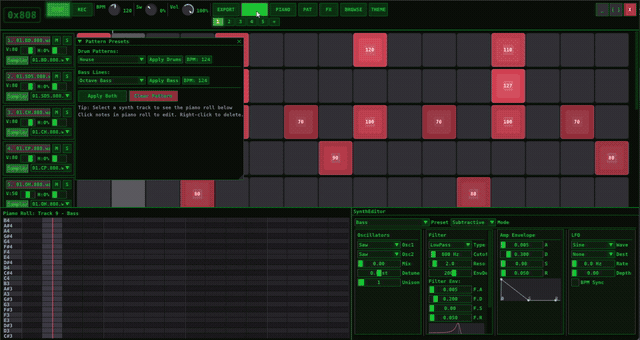
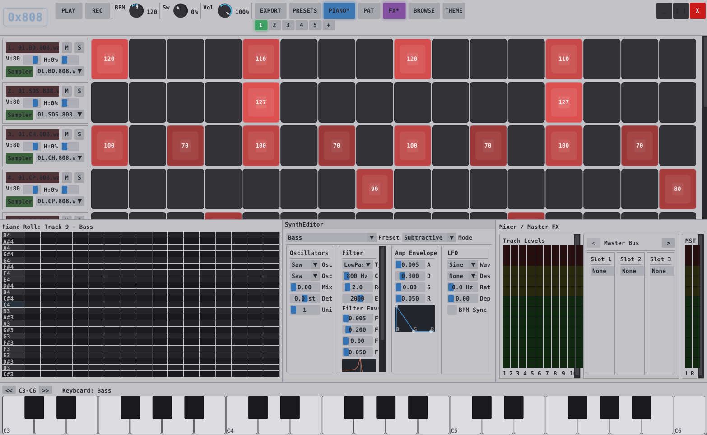
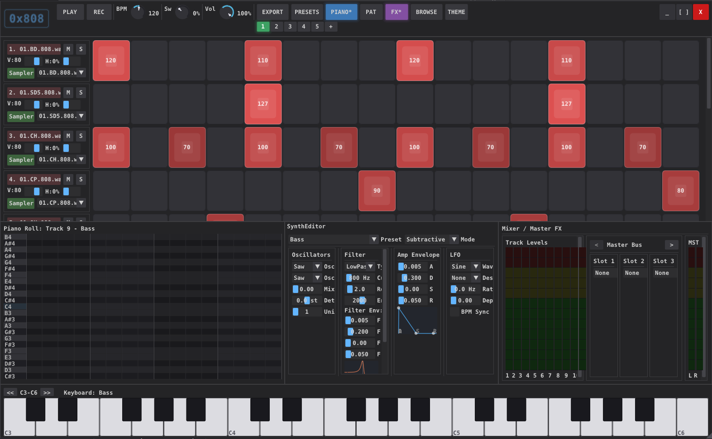
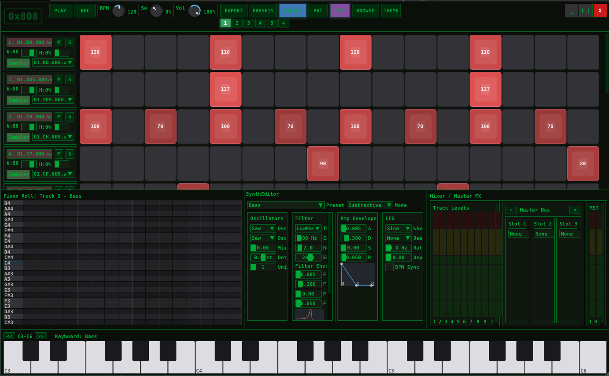

# 0x808

**Drum machine & synth workstation — C engine, C++ GUI**



> **[Watch full demo video](https://projects.dcmichael.com/0x808_demo.mp4)**

A standalone drum machine, step sequencer, and synthesizer — also available as a VST3/CLAP plugin. 72 bundled drum samples, 50 synth presets, pattern-based arrangement, and offline WAV export. All dependencies vendored, zero external runtime dependencies.

## Screenshots

### Light Theme


### Dark Theme


### Hacker Theme


3 built-in themes + user-defined themes via JSON files in the `themes/` folder.

## Features

- **Drum grid** — 16-track step sequencer with velocity, pitch per step, mute/solo
- **Piano roll** — melodic note editing with variable-length notes
- **3 synthesis modes** — subtractive, FM (4-op), and wavetable with 50 presets
- **SoundFont support** — load .sf2 files via TinySoundFont
- **Sample browser** — load WAV/MP3/FLAC samples, 72 bundled CC0 drum samples
- **Song arrangement** — pattern chaining with song/perform modes
- **Effects** — per-track and master bus filter, delay, reverb, overdrive, fuzz, chorus
- **Export** — offline render to WAV (16/24/32-bit)
- **Project save/load** — JSON-based .sqproj format
- **Undo/redo** — Ctrl+Z / Ctrl+Shift+Z with 32 levels
- **Swing/shuffle** — per-transport swing control (0-100%)
- **Velocity humanization** — per-track random velocity variation

## Plugin Formats

0x808 builds as a standalone application and as an audio plugin:

| Format | Target | Notes |
|--------|--------|-------|
| **Standalone** | `sequencer_gui` | SDL2 + OpenGL + miniaudio |
| **VST3** | `sequencer_vst3` | Works in any VST3-compatible DAW |
| **CLAP** | `sequencer_clap` | Works in Bitwig, Reaper, and other CLAP hosts |

## Keyboard Shortcuts

| Key | Action |
|-----|--------|
| Space | Play / Stop |
| 1-9 | Select pattern |
| + | New pattern |
| Ctrl+S | Save project |
| Ctrl+O | Load project |
| Ctrl+C | Copy pattern |
| Ctrl+V | Paste pattern |
| Ctrl+Z | Undo |
| Ctrl+Shift+Z | Redo |
| Ctrl+T | Toggle theme |
| Escape | Quit |

## Mouse Controls

### Drum Grid (Step Sequencer)

| Action | Behavior |
|--------|----------|
| **Left-click** | Toggle pad on/off (velocity 100) |
| **Left-click + drag** | Paint pads on or off across the grid |
| **Right-click (tap)** | Open velocity/pitch popup editor |
| **Right-click + hold + drag left/right** | Adjust velocity in real-time |
| **Right-click + hold + drag up/down** | Adjust pitch offset in real-time |

### Piano Roll

| Action | Behavior |
|--------|----------|
| **Left-click** | Place or remove a note |
| **Scroll wheel** | Scroll the view vertically |

### Virtual Keyboard

| Action | Behavior |
|--------|----------|
| **Click keys** | Trigger synth notes |
| **QWERTY keys** (when Piano panel is open) | Play notes — Z-M = lower octave, Q-P = upper octave |
| **<< / >>** | Shift keyboard octave range |

### Track Management

| Action | Behavior |
|--------|----------|
| **"+ Sampler Track" button** | Add a new sampler track (inserted before synth tracks) |
| **"+ Synth Track" button** | Add a new synth track (appended at end) |
| **Right-click track name** | Cycle track color |
| **Click track name** | Select track (shows piano roll / synth editor for synth tracks) |

## Building

### Requirements

- C11 compiler (GCC, Clang, or MSVC) — engine and tests
- C++17 compiler — GUI layer (Dear ImGui)
- CMake 3.16+
- SDL2 (for GUI targets)
- OpenGL 3.3 (for GUI targets)

All other dependencies are vendored in `deps/`.

### Linux

```bash
sudo apt install libsdl2-dev libgl-dev g++   # Debian/Ubuntu
cmake -B build -DCMAKE_BUILD_TYPE=Release
cmake --build build -j$(nproc)
```

### macOS

```bash
brew install sdl2
cmake -B build -DCMAKE_BUILD_TYPE=Release
cmake --build build -j$(sysctl -n hw.ncpu)
```

### Windows (MSVC + vcpkg)

```powershell
vcpkg install sdl2:x64-windows
cmake -B build -DCMAKE_BUILD_TYPE=Release -DCMAKE_TOOLCHAIN_FILE=$env:VCPKG_INSTALLATION_ROOT/scripts/buildsystems/vcpkg.cmake
cmake --build build --config Release
```

### Windows (MinGW cross-compile from Linux)

```bash
sudo apt install gcc-mingw-w64-x86-64 g++-mingw-w64-x86-64
cmake -B build_win -DCMAKE_TOOLCHAIN_FILE=cmake/mingw-w64.cmake
cmake --build build_win -j$(nproc)
```

### Build Targets

| Target | Description |
|--------|-------------|
| `sequencer_gui` | Full GUI application (SDL2 + OpenGL + Dear ImGui) |
| `sequencer_standalone` | Terminal-only audio engine (miniaudio) |
| `sequencer_vst3` | VST3 plugin |
| `sequencer_clap` | CLAP plugin |

## Running

```bash
# GUI application
./build/sequencer_gui

# Terminal mode
./build/sequencer_standalone
```

## Testing

16 test targets covering DSP, synthesis, effects, project I/O, undo, edge cases, fuzzing, plugin loading, and snapshot regression.

```bash
# Run the full test suite
./scripts/test_all.sh

# Full mode includes AddressSanitizer + UBSan
./scripts/test_all.sh full
```

## Architecture

```
+---------------------------------------------+
|  Layer 3: Host Wrapper                      |
|  Standalone (miniaudio) | VST3 | CLAP      |
+---------------------------------------------+
|  Layer 2: GUI (Dear ImGui + SDL2 + OpenGL)  |
|  Drum grid, piano roll, knobs, arrangement  |
+---------------------------------------------+
|  Layer 1: DSP Engine (pure C, zero deps)    |
|  Sequencer, sampler, synth, mixer, effects  |
|  Input: transport state -> Output: float buf|
+---------------------------------------------+
```

The engine (Layer 1) has zero knowledge of GUI or audio drivers. It receives transport state and produces float audio buffers. Audio runs on a separate thread from the GUI.

## Bundled Samples

72 CC0 drum samples from classic machines:
- **TR-808** — bass drum, snare, clap, hi-hat, cowbell, cymbal, toms
- **TR-909** — bass drum, snare, clap, hi-hat, ride, crash, toms
- **TR-505** — bass drum, snare, hi-hat, toms, clap, rimshot
- **MRK-2** — kicks, snares, hi-hats, claps, toms
- **CR-78 / LM-2** — additional percussion

## Synth Presets

50 built-in presets across 3 synthesis modes:

**Subtractive**: Bass, Pad, Lead, Pluck, Stab, plus classic-inspired presets (Moog, 303 Acid, Juno Pad, OBX Brass, Prophet Strings, ARP Lead, SH Rez, and more)

**FM**: Bell, E.Piano, Metal, Bass, Pad, DX Piano, DX Vibes, FM Organ, FM Marimba, FM Clav, FM Strings, FM Koto, FM Flute, FM Harmonics, DX Sitar

**Wavetable**: Sweep, Harmonic, PWM, Vocal, WT Glass, WT Wobble, WT Choir

## Dependencies (vendored)

| Library | License | Purpose |
|---------|---------|---------|
| [miniaudio](https://miniaud.io/) | Public Domain | Cross-platform audio I/O |
| [Dear ImGui](https://github.com/ocornut/imgui) | MIT | Immediate-mode GUI (C++) |
| [dr_wav/dr_mp3/dr_flac](https://github.com/mackron/dr_libs) | Public Domain | Audio file decoding |
| [TinySoundFont](https://github.com/schellingb/TinySoundFont) | MIT | SoundFont2 synthesis |
| [cJSON](https://github.com/DaveGamble/cJSON) | MIT | JSON parsing for project files |

## License

MIT
